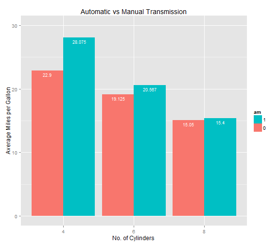
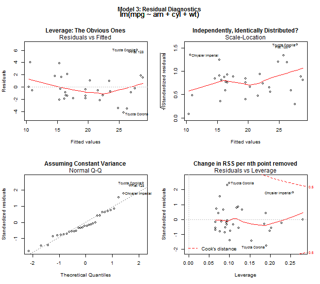

## Abstract
  
- Data Set ```mtcars ```, from 1974 $Motor Trend$ US Magazine  
- There is no difference in using Automatic Transmission or Manual Transmission in increasing Mileage  
- A person buying a car should look at the influential factors: Number of Cylinders and Weight of Car  

---  
## Overview of Data
  


---  
## Observations

- Motor vehicle with Manual Transmission, on average, achieved better mileage compared to vehicles with Automatic Transmission  
- Difference is not significant for motor vehicles with 8 cylinders installed  

---  
## Rationale for Regression
  
### Problems  
  
- How do other variables affect Mileage of a motor vehicle then?  
- Intuition tells us that Number of Cylinders installed and weight of a car affects Mileage. Is it true?  
- Multiple Linear Regression is used  
- Reason: We are expecting discrete observations here  

### Hypothesis Used  
  
- $H_0$: *There is no difference between cars using Automatic Transmission and Manual Transmission*    
- $H_1$: *There is a difference between between cars using Automatic Transmission and Manual Transmission*  

---  
## Tests Conducted  
  
- ANOVA (Analysis of Variance Test): ANOVA compares 4 constructed models, with the significant F-statistic that qualifies the model  
- $R^2$ value: Higher $R^2$ value means better predictability from the model  
- Residual Diagnostics will be conducted to ensure normality of data used in the model. Only then will the Best Fit Model  be chosen  
- Gosset's $t$ test will be conducted after we have chosen our Best Fit Model  

---  
## Best Fit Model: Model Construction  
  
4 Models will be fitted, with Mileage as the Outcome we want:
  
- Model 1: Automatic Transmission ('am') only
- Model 2: Automatic Transmission ('am') and Number of Cylinders ('cyl') installed  
- Model 3: Automatic Transmission ('am'), Number of Cylinders installed ('cyl') and Weight of the car ('wt')  
- Model 4:  Automatic Transmission ('am'), Number of Cylinders installed ('cyl'), Weight of the car ('wt'), Number of Carburetors in the car ('carb')
  
R Squared Values Obtained  
  

```
##      model    r_squared
## [1,] "model1" "0.3598" 
## [2,] "model2" "0.759"  
## [3,] "model3" "0.8303" 
## [4,] "model4" "0.8502"
```

---  
## Best Fit Model: ANOVA
  

```
## Analysis of Variance Table
## 
## Model 1: mpg ~ am
## Model 2: mpg ~ am + cyl
## Model 3: mpg ~ am + cyl + wt
## Model 4: mpg ~ am + cyl + wt + carb
##   Res.Df    RSS Df Sum of Sq       F    Pr(>F)    
## 1     30 720.90                                   
## 2     29 271.36  1    449.53 71.9444 4.282e-09 ***
## 3     28 191.05  1     80.32 12.8538  0.001311 ** 
## 4     27 168.71  1     22.34  3.5756  0.069411 .  
## ---
## Signif. codes:  0 '***' 0.001 '**' 0.01 '*' 0.05 '.' 0.1 ' ' 1
```

---
## Best Fit Model: Observations

**Model 3**
- $R^2$ value: 0.8303
- F Statistic: 12.8538, @ 99% Significance Level
- 'cyl' $t$ value: -3.576, @ 99% Significance Level
- 'wt' $t$ value": -3.431, @ 99% Significance Level

**Model 4**
- $R^2$ value: 0.8502
- F Statistic: 3.5756 @ 90% Significance Level  
- 'cyl' $t$ value: -2.740, @ 95% Significance Level
- 'wt' $t$ value": -2.647, @ 95% Significance Level
- 'carb' $t$ value": -1.891, @ 90% Significance Level

---
## Best Fit Model: Observations

- Model 3 is more different from Model 2, as compared to Model 4 versus Model 3
- Prediction level for Model 4 is higher than Model 3, yet there is a reduction in significance level for the $t$ values
- Reduction in significance level means more false positives
- Model 3 will be chosen, unless it passes the Shapiro-Wilk Test (Residual Diagnostics)

---  
## Best Fit Model: Summary of Model 3
  

```
## 
## Call:
## lm(formula = mpg ~ am + cyl + wt, data = mtcars)
## 
## Residuals:
##     Min      1Q  Median      3Q     Max 
## -4.1735 -1.5340 -0.5386  1.5864  6.0812 
## 
## Coefficients:
##             Estimate Std. Error t value Pr(>|t|)    
## (Intercept)  39.4179     2.6415  14.923 7.42e-15 ***
## am            0.1765     1.3045   0.135  0.89334    
## cyl          -1.5102     0.4223  -3.576  0.00129 ** 
## wt           -3.1251     0.9109  -3.431  0.00189 ** 
## ---
## Signif. codes:  0 '***' 0.001 '**' 0.01 '*' 0.05 '.' 0.1 ' ' 1
## 
## Residual standard error: 2.612 on 28 degrees of freedom
## Multiple R-squared:  0.8303,	Adjusted R-squared:  0.8122 
## F-statistic: 45.68 on 3 and 28 DF,  p-value: 6.51e-11
```

---  
## Best Fit Model: Summary of Model 4
  

```
## 
## Call:
## lm(formula = mpg ~ am + cyl + wt + carb, data = mtcars)
## 
## Residuals:
##     Min      1Q  Median      3Q     Max 
## -4.5451 -1.2184 -0.3739  1.4699  5.3528 
## 
## Coefficients:
##             Estimate Std. Error t value Pr(>|t|)    
## (Intercept)  36.8503     2.8694  12.843 5.17e-13 ***
## am            1.7801     1.5091   1.180   0.2485    
## cyl          -1.1968     0.4368  -2.740   0.0108 *  
## wt           -2.4785     0.9364  -2.647   0.0134 *  
## carb         -0.7480     0.3956  -1.891   0.0694 .  
## ---
## Signif. codes:  0 '***' 0.001 '**' 0.01 '*' 0.05 '.' 0.1 ' ' 1
## 
## Residual standard error: 2.5 on 27 degrees of freedom
## Multiple R-squared:  0.8502,	Adjusted R-squared:  0.828 
## F-statistic:  38.3 on 4 and 27 DF,  p-value: 9.255e-11
```

---  
## Residual Diagnostics
  
Sharpiro-Wilk Test tests whether the data is fit for use.  
  

```
## 
## 	Shapiro-Wilk normality test
## 
## data:  resid(model3)
## W = 0.9369, p-value = 0.06108
```

- Residuals fall within the normal curve at 95% significance level, with a p-value of 0.06108  
- Data is normal  
  
For detailed Residual Diagnostics, please refer to the Appendix of the Presentation.  

---  
## Best Fit Model: Model 3
  
With the best model chosen, we can further analyse the results.  
  
### Results
  
$H_0$: *There is no difference between cars using Automatic Transmission and Manual Transmission*    
$H_1$: *There is a difference between between cars using Automatic Transmission and Manual Transmission*  
  
- *t* value is given as 0.135, which is not significant
- We fail to reject $H_0$
- Test Results of Model 3 is given on the next slide  

---
## Conclusion
  
- There is no difference in using Automatic Transmission or Manual Transmission in increasing Mileage  
- A person buying a car should look at the influential factors: 
        (1) Number of Cylinders
        (2) Weight of Car  

---  
## Appendix

---  
## Residual Diagnostics (Extra)
  


---  
## Residual Diagnostics (Extra)
  
- The top 2 plots have shown us, overall, there is no significant trend to the residuals in Model 3, since the red line does not exhibit any certain shape. We can assume that these residuals are independently, identically distributed.  
  
- The bottom left plot shows us that the residuals, overall, followed the normality curve. The dotted line assume constant variance through all the observations.  
  
- Toyota Corolla is 2 standard deviations away normality. Otherwise, the outliers should not affect the analysis much and there is no significant skewedness to the distribution of the residuals.  
  
- The bottom right plot shows us the Cook's Distance, which refers to the change in the overall coefficients when n*th* point is deleted.  

---  
## Residual Diagnostics (Extra)
  
In this case, I have also done an outlier test. It shows Toyota Corolla as the outlier. Do reconsider if you see a Toyota Corolla in the car market, in 1974.  
  

```
## 
## No Studentized residuals with Bonferonni p < 0.05
## Largest |rstudent|:
##                rstudent unadjusted p-value Bonferonni p
## Toyota Corolla 2.719504            0.01129      0.36128
```
